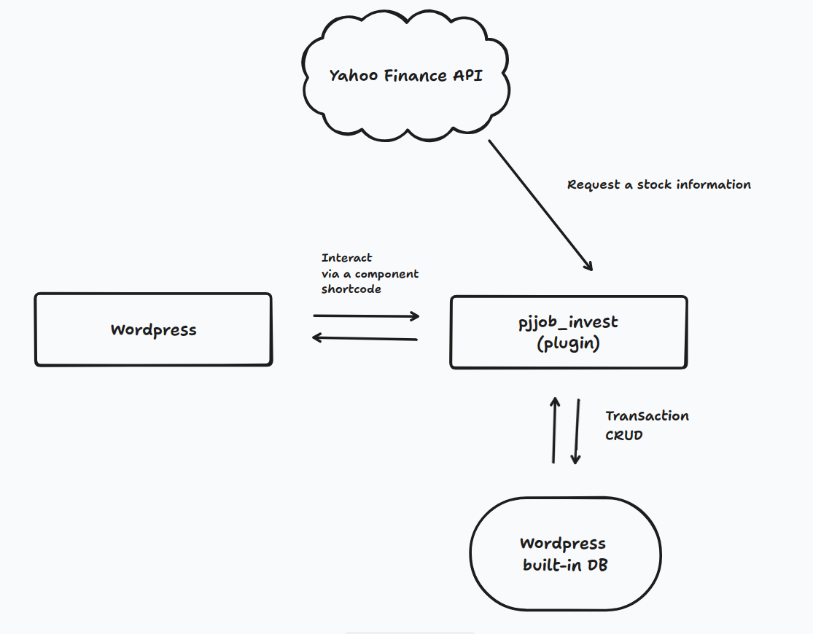
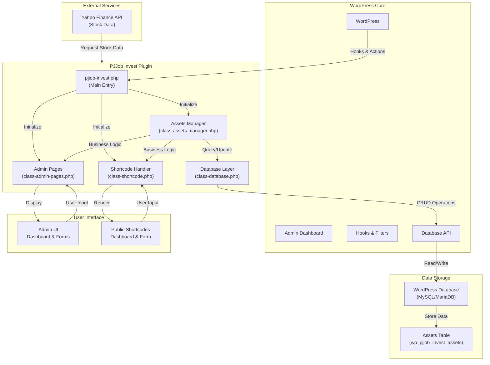
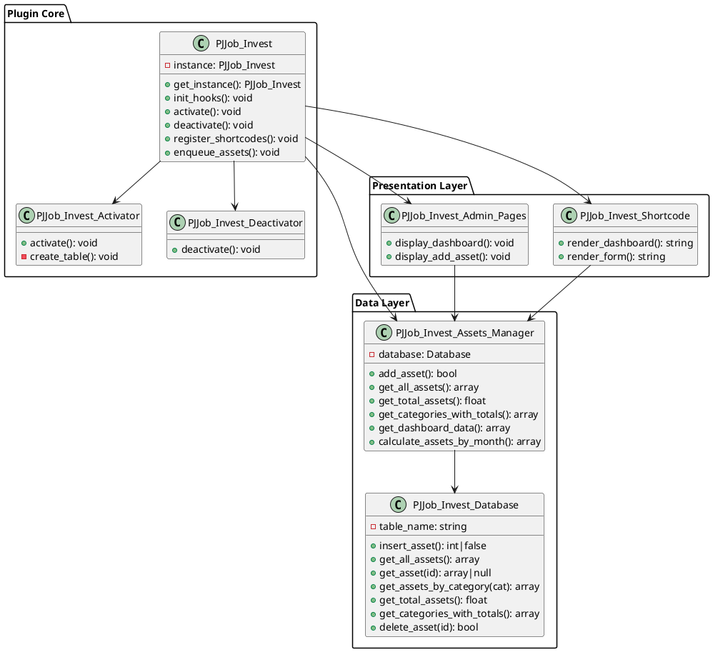

# System Architecture



> **See Also**: [SPECIFICATIONS.md](SPECIFICATIONS.md#system-architecture) for detailed architecture documentation

## Architecture Overview



## Component Architecture (PlantUML)

```plantuml
@startuml PJJob_Invest_Architecture

!define EXTERNAL_COLOR #FFE6CC
!define WORDPRESS_COLOR #1E8CBE
!define PLUGIN_COLOR #00AA66
!define UI_COLOR #FF8C42
!define DATABASE_COLOR #8B008B

package "External Services" #EXTERNAL_COLOR {
    component "Yahoo Finance API" as YahooAPI
}

package "WordPress Framework" #WORDPRESS_COLOR {
    component "WordPress Core" as WPCore
    component "Plugin Hooks\n& Actions" as Hooks
    component "Database API" as DB_API
    component "Admin\nDashboard" as AdminDash
}

package "PJJob Invest Plugin" #PLUGIN_COLOR {
    component "Main Plugin\n(pjjob-invest.php)" as MainPlugin
    
    package "Core Classes" {
        component "Activator" as Activator
        component "Deactivator" as Deactivator
        component "Shortcode\nHandler" as ShortcodeClass
        component "Admin Pages" as AdminPagesClass
        component "Assets\nManager" as AssetsManager
        component "Database\nLayer" as DBClass
    }
}

package "User Interface" #UI_COLOR {
    component "Admin UI\n[Dashboard]\n[Add Asset Form]" as AdminUI
    component "Public UI\n[Shortcodes]\n[Dashboard]\n[Form]" as PublicUI
}

package "Data Layer" #DATABASE_COLOR {
    database "WordPress\nDatabase" as DB
    component "Assets Table\nwp_pjjob_invest_assets" as AssetsTable
}

' External Interactions
YahooAPI -.->|Stock Information| AssetsManager : Future Enhancement

' WordPress Integration
WPCore --> Hooks : provides
MainPlugin --> Hooks : uses
Hooks --> MainPlugin : triggers
Hooks --> AdminPagesClass : triggers
Hooks --> ShortcodeClass : triggers

' Admin Flow
AdminDash --> AdminUI
AdminUI --> AdminPagesClass : user actions
AdminPagesClass --> AssetsManager : business logic
AdminPagesClass --> AdminDash : displays dashboard

' Public Flow
ShortcodeClass --> PublicUI
PublicUI -.->|User Input| ShortcodeClass : AJAX

' Business Logic
AssetsManager --> DBClass : data operations
AssetsManager --> AdminPagesClass : provides data
AssetsManager --> ShortcodeClass : provides data

' Database Operations
DBClass --> DB_API : executes queries
DB_API --> DB : read/write
DB --> AssetsTable : persists data

' Plugin Lifecycle
MainPlugin --> Activator : on activation
MainPlugin --> Deactivator : on deactivation
Activator --> DB : creates table
Deactivator --> DB : cleanup

@enduml
```

## Layered Architecture Diagram

```plantuml
@startuml PJJob_Invest_Layers

package "Presentation Layer" #FF8C42 {
    rectangle "Admin Interface" as AdminLayer
    rectangle "Public Shortcodes" as PublicLayer
}

package "Application Layer" #00AA66 {
    rectangle "Admin Pages Controller" as AdminController
    rectangle "Shortcode Renderer" as ShortcodeRenderer
}

package "Business Logic Layer" #00AA66 {
    rectangle "Assets Manager" as BusinessLogic
    rectangle "Data Processing" as DataProcessing
}

package "Data Access Layer" #00AA66 {
    rectangle "Database Abstraction" as DAL
    rectangle "Query Builder" as QueryBuilder
}

package "Integration Layer" #1E8CBE {
    rectangle "WordPress Hooks" as WHooks
    rectangle "WordPress APIs" as WAPI
}

package "External Services" #FFE6CC {
    rectangle "Yahoo Finance API" as ExtAPI
}

package "Storage Layer" #8B008B {
    database "MySQL/MariaDB" as Database
    rectangle "wp_pjjob_invest_assets" as Table
}

AdminLayer --> AdminController : calls
PublicLayer --> ShortcodeRenderer : calls

AdminController --> BusinessLogic : delegates
ShortcodeRenderer --> BusinessLogic : delegates

BusinessLogic --> DataProcessing : processes
DataProcessing --> BusinessLogic : returns

BusinessLogic --> DAL : requests
DAL --> QueryBuilder : uses

QueryBuilder --> WAPI : executes
WAPI --> Database : SQL queries

Database --> Table : stores/retrieves

WHooks -.-> BusinessLogic : triggers actions
WHooks -.-> AdminController : triggers events

ExtAPI -.->|Future| BusinessLogic : price data

@enduml
```

## Data Flow Diagram

```plantuml
@startuml PJJob_Invest_DataFlow

' User Actions
(*) --> [User adds investment] AdminUI_Form
AdminUI_Form --> [Fill form] Form_Input
Form_Input --> [Submit AJAX] AJAX_Validate

' Validation & Processing
AJAX_Validate --> {Valid?}
{Valid?} -->|No| Error_Msg
Error_Msg --> [Display Error] AdminUI_Form

{Valid?} -->|Yes| Sanitize
Sanitize --> Validate_Business_Rules
Validate_Business_Rules --> {Business Valid?}
{Business Valid?} -->|No| Error_Msg

' Database Operations
{Business Valid?} -->|Yes| Insert_Asset
Insert_Asset --> [Insert to DB] Database_Store
Database_Store --> [Update Dashboard Cache] Cache_Update
Cache_Update --> [Return Success] Success_Response

' UI Updates
Success_Response --> [Update UI] Dashboard_Refresh
Dashboard_Refresh --> [Show Charts] Chart_Render
Chart_Render --> [User sees updated portfolio] AdminUI_Dashboard

' View Dashboard
(*) --> [User views portfolio] AdminUI_Dashboard
AdminUI_Dashboard --> [Request Data] Fetch_Dashboard_Data
Fetch_Dashboard_Data --> [Check Cache] Cache_Check

Cache_Check -->|Cache Hit| Use_Cache
Cache_Check -->|Cache Miss| Query_DB

Use_Cache --> [Return cached data] Dashboard_Data
Query_DB --> [Query assets] Run_Queries
Run_Queries --> [Calculate totals] Calculations
Calculations --> [Cache results] Store_Cache
Store_Cache --> [Return data] Dashboard_Data

Dashboard_Data --> [Render dashboard] Render_UI
Render_UI --> [Display to user] AdminUI_Dashboard

@enduml
```

## Class Diagram



## Deployment Architecture

```plantuml
@startuml PJJob_Invest_Deployment

cloud "Web Server" {
    folder "WordPress Installation" {
        folder "wp-content/plugins" {
            folder "pjjob-invest" {
                file "pjjob-invest.php"
                file "uninstall.php"
                folder "includes"
                folder "admin"
                folder "public"
                folder "languages"
            }
        }
    }
}

database "MySQL Database" {
    table "WordPress Tables" {
        table "wp_users"
        table "wp_posts"
    }
    table "Plugin Tables" {
        table "wp_pjjob_invest_assets"
    }
}

actor "Admin User" as Admin
actor "Site Visitor" as Visitor

Admin --> "WordPress Admin\nPanel" : login
"WordPress Admin\nPanel" --> "Invest Menu\n(Add Asset/Dashboard)" : navigate

Visitor --> "WordPress\nPublic Pages" : visit
"WordPress\nPublic Pages" --> "Shortcodes\n[pjjob_invest_*]" : display

"Invest Menu\n(Add Asset/Dashboard)" --> "pjjob-invest" : AJAX
"Shortcodes\n[pjjob_invest_*]" --> "pjjob-invest" : query

"pjjob-invest" --> "MySQL Database" : queries

@enduml
```

---

## Architecture Components Summary

### External Layer
- **Yahoo Finance API**: External service for real-time stock data (future enhancement)

### WordPress Framework Layer
- **WordPress Core**: Provides plugin hooks, filters, and database API
- **Admin Dashboard**: WordPress built-in admin interface
- **Database API**: WordPress database abstraction layer

### Plugin Layer

#### Core Classes
- **pjjob-invest.php**: Main entry point and initialization
- **PJJob_Invest_Activator**: Handles plugin activation
- **PJJob_Invest_Deactivator**: Handles plugin deactivation
- **PJJob_Invest_Database**: Data access layer (CRUD)
- **PJJob_Invest_Assets_Manager**: Business logic layer
- **PJJob_Invest_Shortcode**: Public shortcode rendering
- **PJJob_Invest_Admin_Pages**: Admin interface

### Presentation Layer
- **Admin UI**: Dashboard and forms in WordPress admin
- **Public UI**: Shortcodes for front-end display

### Data Storage Layer
- **WordPress Database**: MySQL/MariaDB
- **Assets Table**: wp_pjjob_invest_assets

---

## Data Flow Directions

### User → System
1. **Admin Input**: Form submission via AJAX
2. **Public Input**: Shortcode form via AJAX
3. **Dashboard View**: Direct page load

### System → Data
1. **Validation & Sanitization**: Input security
2. **Business Logic Processing**: Data transformation
3. **Database Operations**: Persist/retrieve data

### Data → Display
1. **Query Execution**: Retrieve from database
2. **Caching**: Store in transients
3. **Rendering**: Template processing
4. **Display**: Show to user

---

## Security Boundaries

```
┌─────────────────────────────────────┐
│         User Interface (Public)      │
├─────────────────────────────────────┤
│   Input Validation & Sanitization   │
├─────────────────────────────────────┤
│   Business Logic Layer              │
│   (Nonce verification, Auth check)  │
├─────────────────────────────────────┤
│   Database Abstraction              │
│   (Prepared statements)             │
├─────────────────────────────────────┤
│   WordPress Database API            │
├─────────────────────────────────────┤
│   Database (MySQL/MariaDB)          │
└─────────────────────────────────────┘
```

---

**Reference**: Section 2 of [SPECIFICATIONS.md](SPECIFICATIONS.md)  
**Status**: ✅ Complete